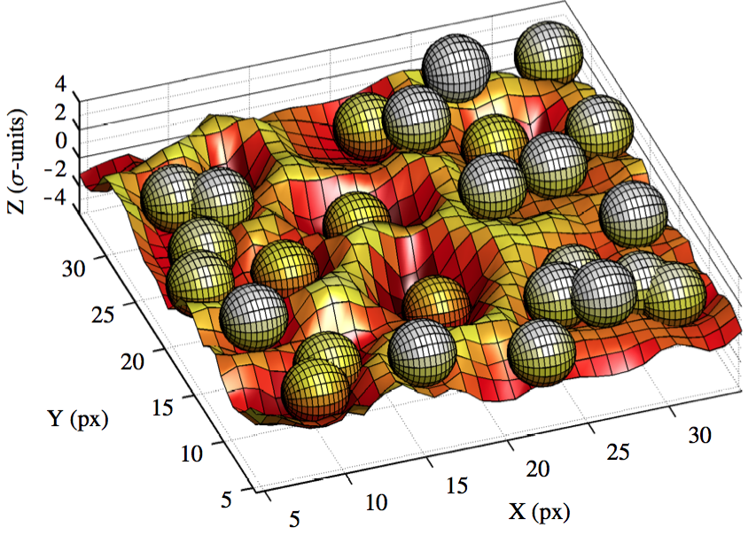

# README #

Python framework implementing the Balltracking ang Magnetic Balltracking algorithms for the data of the Helioseismic and Magnetic Imager (HMI) onboard the Solar Dynamics Observatory (SDO) 
These algorithms track plasma motions from intensity continuum images (Balltracking) and from magnetograms (Magnetic Balltracking).

### How do I get set up? ###

Following instructions are for linux and mac. 
I recommend using anaconda and conda virtual environments.
First install anaconda for Python 3.x: https://www.anaconda.com/download/
Using the provided requirements.txt file, you can install all packages at proper versions at once. 
You don't have to use virtual environment though to use the requirements file. It's just a way to keep this project isolated from your main Python installation (if you have one already).

After installation, make sure you have the "conda" command working. E.g: (from terminal, try ``conda -V``)
Then create a new virtual environment, give it whatever name you want (here, i call it ``new_environment``), and using the *requirements.txt* file,
from a terminal, execute the following:
``conda create -n new_environment --file requirements.txt``

For Balltracking only, and not Magnetic Balltracking (in *balltracking.mballtrack*), you will also need to run a calibration procedure.
After calibration, the function to embed in a script is found in the *balltracking.balltrack* module and called *balltrack_all*. 

See examples (won't work as is, adapt to your data):

- Calibration: see *balltracking_test_scripts/test_calibration*
- To run Balltracking: *AR12673/script_balltrack_AR12673.py*
- To process flow maps upon balltracking results, see *script_velocity_lanes_AR12673.py*

### Who do I talk to for help? ###

Dr. Raphael Attie at NASA/Goddard Space Flight Center